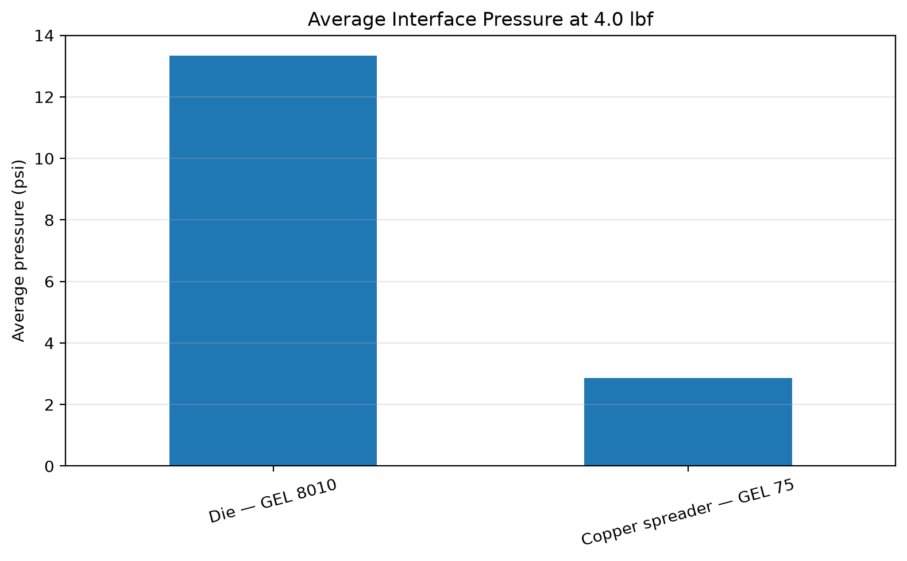
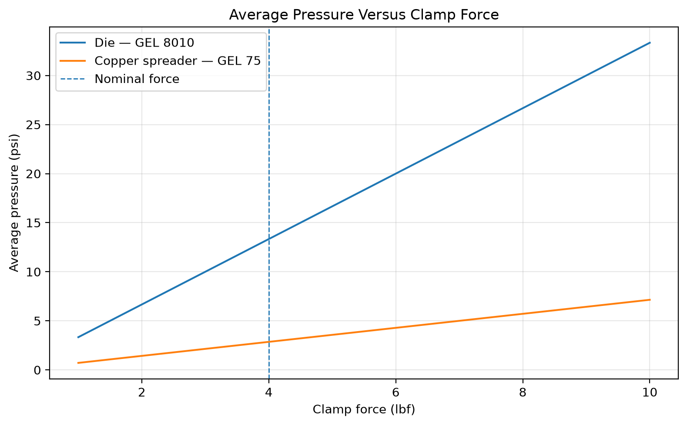
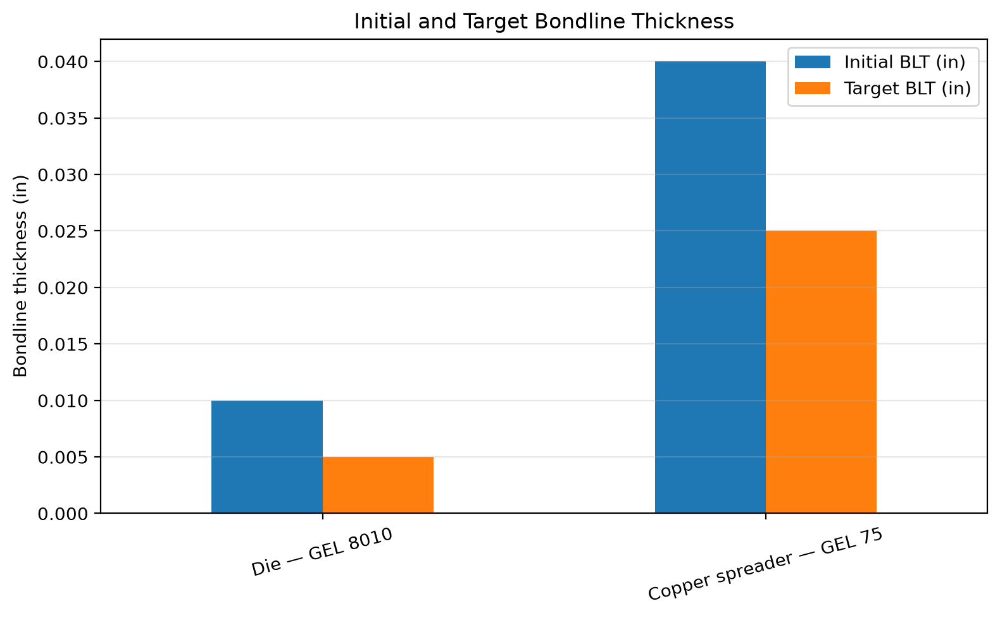
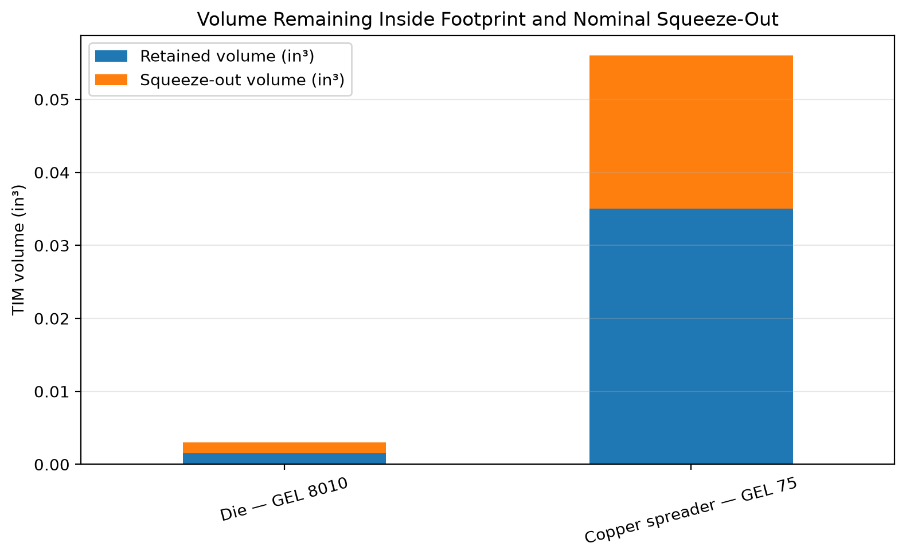

## Model scope

This model calculates average interface pressure, compression geometry,
TIM volume displacement, and idealized squeeze-out under an approximate
volume-conservation assumption.

It does not predict final bondline thickness from applied force unless
material-specific compression data or experimental measurements are supplied.

Results should be validated using a controlled compression fixture before
being used for production design decisions.

## Baseline configuration

| Interface | Material | Area | Initial BLT | Target BLT | Average pressure |
|---|---|---:|---:|---:|---:|
| Die | GEL 8010 | 0.300 in² | 0.010 in | 0.005 in | 13.33 psi |
| Copper spreader | GEL 75 | 1.400 in² | 0.040 in | 0.025 in | 2.86 psi |

Applied load: **4 lbf**

### Baseline assumptions

- No load bypass
- Same resultant force through both interfaces
- Flat and parallel contact surfaces
- Approximately incompressible TIM for geometric volume calculations
- Static and centered applied load
- Average pressure rather than local pressure distribution

## Example output

### Average interface pressure

### Pressure sensitivity to clamp force

### Initial and target bondline thickness

### Retained and displaced TIM volume

## Sharing statement

This repository contains a Jupyter-based TIM compression and squeeze-out
model for the current die and copper-spreader stack. It calculates average
pressure, compression geometry, displaced volume, and force sensitivity.

The current version is a geometric model. Material-specific
pressure-to-bondline behavior still requires experimental validation.